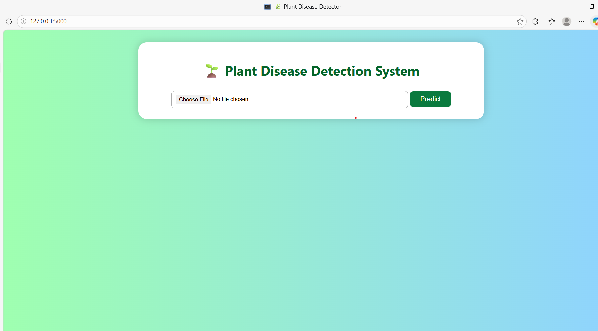
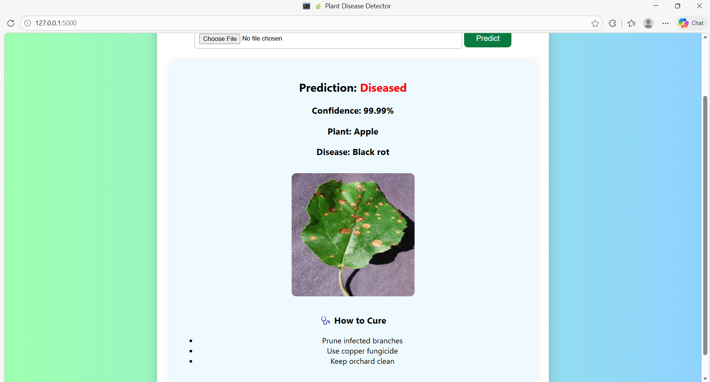

# 🌿 Plant Disease Detection

## 📌 Project Description
This project uses Machine Learning to detect plant diseases from leaf images.  
It helps in early identification of plant diseases, which is useful for farmers and agriculture.

---

## ⚙️ Technologies Used
- Python
- Machine Learning / Deep Learning
- OpenCV / TensorFlow / Keras (edit based on your project)

---

## 🧠 Model Details

- Model Used: Convolutional Neural Network (CNN)
- Task: Image classification of plant leaf diseases
- Dataset: Plant leaf image dataset (mention source if known)
- Image Preprocessing: Image resizing and normalization
- Training Split: 80% training, 20% testing
- Epochs: 1000
- Training Time: Approximately 1 day
- Accuracy: Model achieved good performance on test data (exact accuracy to be updated)

The model was trained on a large number of epochs to improve learning and achieve better accuracy in detecting plant diseases from leaf images.

## 📸 Output Screenshots

### Input Image

### Prediction Result

---

## 🚀 How to Run
1. Clone the repository  
2. Install dependencies  
3. Run the main file  

---

## 📌 Future Improvements
- Add web interface (Streamlit/Flask)
- Improve model accuracy
- Add more disease classes
